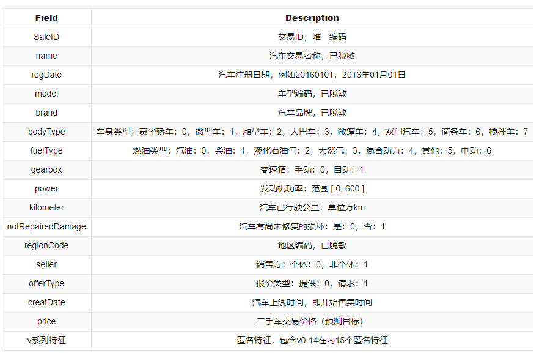

## 项目背景
在当今的汽车市场中，二手车的价格受到多种因素的影响。通过机器学习技术，我们可以分析历史数据，建立模型，从而更准确地预测二手车的价格。这不仅可以帮助消费者做出更明智的购买决策，也可以为卖家提供合理的定价参考。

## 项目目录结构
```
ml_regression_carprice_predic
├── README.md
├── requirements.txt
├── src
│   ├── app.py
│   ├── data_processing
│   ├── datasets
│   ├── models
│   ├── training
│   ├── utils
├── .gitignore
```

### 数据集简介
#### 下载地址
https://tianchi.aliyun.com/dataset/175540

#### 内容简介
这是阿里天池上的一个数据集，该数据集为二手车交易价格数据集，数据来自某交易平台的二手车交易记录，总数据量超过40w，包含31列变量信息，其中15列为匿名变量。

#### 数据情况

| 数据名称| 上传日期 | 大小  |
|:--------------------------|:------------|:---------|
| used_car_testB_20200421.csv | 2024-04-16 | 17.06MB |
| used_car_train_20200313.csv | 2024-04-16 | 51.77MB |

#### 数据字段



## 使用方法
1. 安装依赖
```
pip install -r requirements.txt
```
2. 运行项目
```
streamlit run app.py
```


## 声明
本项目仅供学习交流使用，原创内容不易，转载请注明出处。