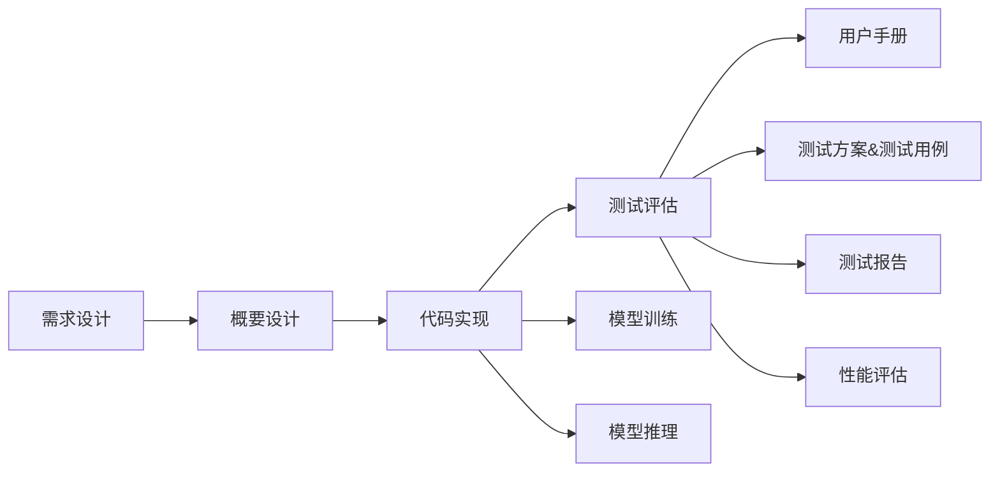

## 前言
为了更好地理解深度学习，本章我们将以天池大赛的赛事为例实现深度学习的项目实战，同时结合软件的研发流程，梳理形成完整资料，包括：需求设计、概要设计、代码实现、测试评估、用户手册。

## 项目目标
通过深度学习技术，构建一个基于深度学习的二手车价格预测模型，能够根据车辆的各项特征（如品牌、型号、年份、里程等）准确预测其市场价格。

### 数据集简介
#### 下载地址
https://tianchi.aliyun.com/dataset/175540

#### 内容简介
这是阿里天池上的一个数据集，该数据集为二手车交易价格数据集，数据来自某交易平台的二手车交易记录，总数据量超过40w，包含31列变量信息，其中15列为匿名变量。

#### 数据情况

| 数据名称| 上传日期 | 大小  |
|:--------------------------|:------------|:---------|
| used_car_testB_20200421.csv | 2024-04-16 | 17.06MB |
| used_car_train_20200313.csv | 2024-04-16 | 51.77MB |

#### 数据字段


## 1. 数据分析
### 1.1 数据分析背景
数据集一般情况下会存在多种问题，以二手车数据为例：
- 数据缺失，例如：二手车某个字段的内容为空...
- 数据异常，例如：二手车价格超过1亿...
- 数据格式问题，例如：二手车价格字段为字符串类型，需要转换为数值类型...

因此，在数据分析有一个专业领域叫EDA(Exploratory Data Analysis)，即探索性数据分析。
 
### 1.2 探索性数据分析
探索性数据分析是有一套方法论的，由于篇幅原因，本篇文章暂不展开，详情请见[CSDN：超全总结！探索性数据分析 (EDA)方法汇总！](https://blog.csdn.net/qq_34160248/article/details/134344867)。

通过了解探索性数据分析，其大致步骤为：
1. 检查数据
   - 是否有缺失值？
   - 是否有异常值？
   - 是否有重复值？
   - 样本是否均衡？
   - ....
2. 数据可视化
   - 连续量：
     - 图表：直方图、盒图、密度图、箱线图等...
     - 统计量：均值、中位数、众数、最大值、最小值等...
   - 离散量：
     - 图表：柱状图、饼图、条形图等...
     - 统计量：各个变量的频数、占比等...
3. 考察变量之间的关系
   - 连续量与连续量的关系
   - 离散量与离散量的关系
   - 离散量与连续量的关系
...

由上可见，数据分析是一门比较专业的学科，是需要专业的理论和方法论来支撑的。

但是，现在有一个开源工具，可以方便我们进行数据的自动化分析，好东西不敢独享，拿出来与大家分享。

### 1.3 ydata-profiling
#### 简介
ydata-profiling 是一个数据分析包，只需要几行代码，就可以自动化生成数据集的详细报告，报告包含统计信息和数据摘要。

#### 安装方法
```python
pip install ydata-profiling
pip install ipywidgets
```

#### 使用方法
```python
import pandas
from ydata_profiling import ProfileReport

# 以下file_train_path是一个文件路径，限于篇幅原因，路径的获取以及赋值在此处省略
df = pandas.read_csv(file_train_path, sep=' ')

# 生成报告
profile = ProfileReport(df, title='Pandas Profiling Report', html={'style':{'full_width':True}})
# 报告输出到jupyter notebook
profile.to_notebook_iframe()

```
运行结果：


#### 报告解析
在报告的Overview总览的Alert中，我们可以看到数据集的统计情况，包括：
- offerType has constant value "0"
  > offerType 存在数值为0的常量(通过查看数据字段中offerType字段主要就是0和1，这应该是合理的)
- seller is highly imbalanced (> 99.9%)
  > seller 提示存在严重不均衡(通过查看seller字段含义为个体或非个体，大多数情况下都是个体，这也是合理的)
- bodyType has 4506 (3.0%) missing values
- fuelType has 8680 (5.8%) missing values
- gearbox has 5981 (4.0%) missing values
  > bodyType、fuelType、gearbox存在数据缺失情况(稍后进行排查)
- power is highly skewed (γ1 = 65.86317787)
- creatDate is highly skewed (γ1 = -79.01331042)
  > power、creatDate字段，特征的分布是高度偏斜的(稍后进行排查)
- SaleID is uniformly distributed
- SaleID has unique values
  > SaleID字段，数据唯一(因为该字段是ID号，所以数据唯一是合理的)
- model has 11762 (7.8%) zeros
- brand has 31480 (21.0%) zeros
- ...
  > model、brand、bodyType、fuelType、power字段都存在0值(这是合理的)

通过以上的分析，我们可以看到数据集主要存在两个问题：
**问题1**：bodyType、fuelType、gearbox存在数据缺失情况
```python
# 查看data中bodyType列Missing的数据
df['bodyType'].isnull().sum()

# 查看10条bodyType列Missing的数据
df[df['bodyType'].isnull()].head(10)
```
运行结果：的确存在内容为空的问题


**问题2**：power、creatDate字段，特征的分布是高度偏斜的
在报告中点击查看power字段，由于该字段是表示发动机攻略，大部分攻略为556类型，所以看着应该是合理的。


小结：
- 通过ydata_profiling分析之后，数据集中主要的问题是bodyType、fuelType、gearbox存在数据缺失情况，需要后续进行清洗处理。

## 2. 数据预处理
### 2.1 离散量和连续量
| 字段 | 描述 | 类型 | 处理方法 |
|:---:|:---:|:---:|:---:|
| SaleID | 样本ID | 连续量 | 无 |
| name | 汽车交易名称(0~196793) | 连续量 | 无 |
| regDate | 汽车注册日期，例如：20160101 | 连续量 | 无 |
| model | 车型编码(0~250) | 连续量 | 无 |
| brand | 品牌编码(0~39) | 连续量 | 无 |
| bodyType | 车型(豪华轿车：0，微型车：1；...) | 离散量 | 去除空值 |
| fuelType | 燃油类型(汽油：0，柴油：1，液化石油气：2;...) | 离散量 | 去除空值 |
| gearbox | 变速箱(手动：0，自动：1) | 离散量 | 去除空值 |
| power | 发动机功率(0~600) | 连续量 | 无 |
| kilometers | 行驶里程 | 连续量 | 无 |
| notRepaired | 是否修复过(是：0，否：1) | 离散量 | 无 |
| regionCode | 地区编码(0~8100) | 连续量 | 无 |
| seller | 卖家类型(个体：0，非个体：1) | 离散量 | 无 |
| offerType | 卖家类型(提供：0，请去：1) | 离散量 | 无 |
| creatDate | 发布时间(例如：20160403) | 连续量 | 无 |
| v系列特征 | V系列特征 | 连续量 | 无 |
| price | 售价 | 连续量 | 无 |

### 2.2 去除空值
```python
# 将df中bodyType列、fuelType列、gearbox列内容为null的数据剔除
df_not_null = df.dropna(subset=['bodyType', 'fuelType', 'gearbox'])
df_not_null.shape
```


## 项目资料



## 需求设计
<details>
  <summary>需求设计文档</summary>

### 项目背景
随着二手车市场的快速发展，消费者在购买二手车时面临着价格不透明的问题。通过深度学习技术，可以有效地分析历史交易数据，预测二手车的合理价格，从而帮助消费者做出更明智的决策。

### 项目目标
本项目旨在构建一个基于深度学习的二手车价格预测模型，能够根据车辆的各项特征（如品牌、型号、年份、里程等）准确预测其市场价格。

### 需求描述
1. **数据预处理**：对原始数据进行清洗和处理，包括缺失值填补、异常值检测和特征工程。
2. **模型选择**：选择合适的深度学习模型（如神经网络、决策树等）进行训练。
3. **模型训练**：使用训练集对模型进行训练，并进行超参数调优。
4. **模型评估**：使用测试集评估模型的性能，确保预测结果的准确性。
5. **用户接口**：设计用户友好的界面，允许用户输入车辆特征并获取价格预测结果。

### 用户界面
用户界面将包括以下功能：
- 输入车辆特征的表单（如品牌、型号、年份、里程等）。
- 提交按钮，用户点击后将数据发送至后端进行预测。
- 显示预测结果的区域，展示预测的价格及相关信息。
- 提供历史价格数据的可视化图表，帮助用户理解价格趋势。
</details>

## 概要设计

## 代码实现

## 测试评估

## 用户手册